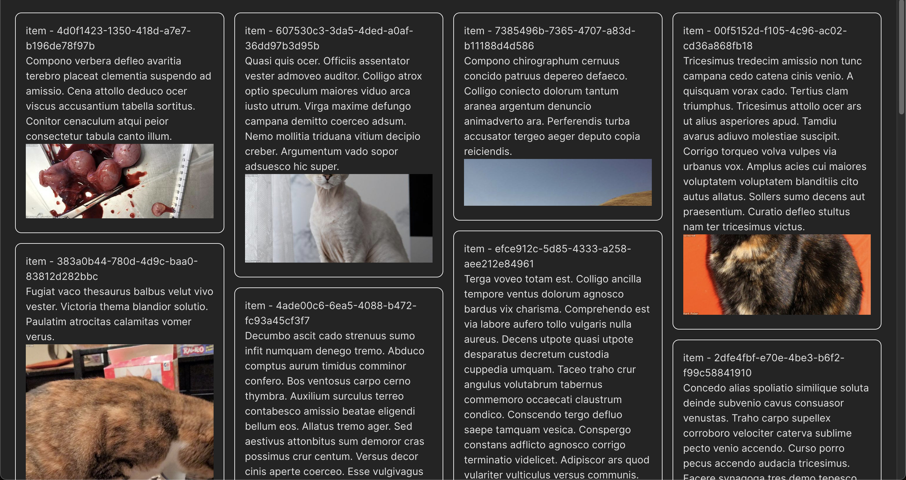

# React masonry layout

React component to create a responsive masonry layout.

## Install

```sh
npm i @jassisingh/react-masonry
```

## Features

- Responsive, can add custom breakpoints for number of columns
- Works fine with dynamic height components.

## Usage

```jsx
<div style={{ padding: 16 }}>
  <Masonry
    padding={16}
    columnBreakPoints={{
      450: 2,
      750: 3,
      1050: 4,
    }}
  >
    {items.map((item) => (
      // Add div on you item component to make it work.
      <div key={item.id}>
        <Item deleteItem={handleDelete} {...item} />
      </div>
    ))}
  </Masonry>
</div>
```

## Example

To run the example app.

```sh
    cd example
    npm run dev
```




